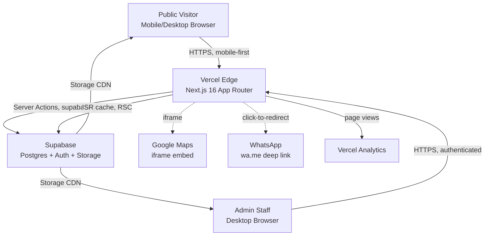

# PRD — Fellaswimming

## 1. Overview

### Product Summary

**Fellaswimming** is the most informative swim school website in Sidoarjo, where families learn first, then register with confidence. It is a lead-generation web application combining a marketing landing page, a 3-step registration form, an educational article surface, and an internal admin dashboard for staff to handle leads and publish content. All payments and trial scheduling happen offline; the website's role is to convert organic traffic into qualified leads with high context.

### Objective

This PRD covers the MVP scope as defined in `docs/product-vision.md` § Product Strategy → MVP Definition. The target shipping window is 8 to 10 weeks given the solo, part-time (10 to 15 hours/week) constraint. The MVP includes all public surfaces (landing, registration, articles), all admin surfaces (auth, overview, pendaftaran management, article CMS, testimoni CMS), and the supporting infrastructure (database schema, RLS policies, storage buckets, deployment). Out-of-scope items are enumerated in § 14.

### Market Differentiation

Other swim schools in Sidoarjo compete on Instagram presence; Fellaswimming opts out and competes on information transparency and educational content. Technically, this means SSR/ISR-grade SEO performance on articles is non-negotiable, landing-page information architecture must be discoverable by article-derived deep links, and admin tools must be reliable enough that staff trust the website as the single source of truth for lead state.

### Magic Moment

A parent reads a Fellaswimming article (e.g. "Usia ideal anak mulai les renang"), follows a contextual CTA at the end of the article, and arrives at a landing-page section that directly answers questions they just learned to ask. Technical enablers:

- Article-to-landing navigation must complete in under 2 seconds (Server Component rendering + ISR cache + landing-page anchor scroll).
- Landing-page sections must be addressable via fragment URLs (`/#jenis-kelas`, `/#pelatih`, etc).
- Article CTA links must be editorial inserts (Tiptap `<a>` with anchor URL), not auto-generated.
- LCP on both article detail and landing page must be under 2.5 seconds on a slow 3G connection.

### Success Criteria

- All P0 functional requirements (§ 6) implemented and verified manually.
- Landing page LCP under 2.5s on mobile 4G; under 4s on slow 3G.
- Articles indexable by Google within 7 days of publish (sitemap + valid OG metadata).
- Lead submission completes in under 3 minutes on mobile end-to-end.
- Admin staff can triage a new lead (open modal → mark contacted → save note) in under 90 seconds.
- WCAG 2.1 AA passing on Lighthouse audit for all public pages.
- Zero P0 security findings on RLS policy review.

---

## 2. Technical Architecture

### Architecture Overview



### Chosen Stack

| Layer | Choice | Rationale |
|---|---|---|
| Frontend | Next.js 16 (App Router) | App Router with React Server Components for SEO-grade SSR/ISR, ideal for the content-heavy article strategy. Largest ecosystem with mature integrations. Founder is proficient (3+ years). Mobile-first responsive via Tailwind. Vercel one-click deploy on free tier. Next 16 introduces `proxy.ts` convention replacing `middleware.ts`. |
| Backend | Supabase | Managed Postgres + Auth + Storage + Edge Functions + Row-Level Security. Relational fit for content + multi-entity data. Founder familiar. Free tier covers MVP (500MB DB, 1GB storage, 50k MAU). Storage built-in for cover images and Tiptap inline images. |
| Database | Supabase Postgres (managed) | Native pairing with Supabase backend. Postgres v17. Excellent fit for Fellaswimming's relational use case (registrations referencing class types, articles with categories, testimonials with featured flags). |
| Auth | Supabase Auth | Native integration with Supabase backend. JWT-based with RLS integration. Email + password for admin only; no public auth. Forgot-password flow via email link. Always use `getUser()` not `getSession()` for authorization. |
| Payments | None | No online payment in scope. Fellaswimming.com is a lead-gen tool for an offline business; payments happen offline (bank transfer or cash at the school) after WhatsApp follow-up. |

### Stack Integration Guide

**Setup order (recommended):**

1. **Scaffold Next.js 16 project** with `npx create-next-app@latest` selecting App Router, TypeScript, Tailwind, ESLint, `src/` directory, and import alias `@/*`.
2. **Install Tailwind v4** if not already at v4 from the scaffold: configure `src/app/globals.css` with `@import "tailwindcss";` and the `@theme` block (see § 9). Remove any generated `tailwind.config.ts` if present.
3. **Install shadcn-ui** with `npx shadcn@latest init`. shadcn v4 uses `@base-ui/react` rather than Radix. Add components as needed: `button`, `input`, `label`, `dialog`, `dropdown-menu`, `select`, `table`, `tabs`, `textarea`, `toast`, `card`, `badge`, `separator`, `skeleton`, `alert`.
4. **Set up Supabase project** at `supabase.com`. Note the project URL and anon key. Region: `ap-southeast-1` (Singapore, closest to Sidoarjo).
5. **Install Supabase clients**: `@supabase/supabase-js` and `@supabase/ssr`. Create three client factories under `src/lib/supabase/`:
   - `client.ts` — browser client using `createBrowserClient`.
   - `server.ts` — server client using `createServerClient` with cookie handlers (`getAll`, `setAll`).
   - `admin.ts` — service-role client using `createClient` from `@supabase/supabase-js` with the service role key (server-only, never imported into Client Components).
6. **Create `src/proxy.ts`** with `proxy()` function (Next 16 convention) for session refresh. The function:
   - Calls `createServerClient` with `getAll`/`setAll` cookie pattern.
   - Calls `supabase.auth.getUser()` to refresh the session cookie.
   - Returns `NextResponse.next()` carrying refreshed cookies.
   - **Important**: Supabase SSR docs still reference `middleware.ts` and `middleware()`; adapt to `proxy.ts` and `proxy()` for Next 16. The internal pattern is identical.
7. **Apply database migrations** (see § 3) via Supabase CLI or Supabase Studio SQL editor. Run RLS policy migrations.
8. **Set up storage buckets**: `article-images` (public read), `article-covers` (public read), `testimonial-photos` (public read). All write-restricted to authenticated admins.
9. **Configure auth**: enable Email provider in Supabase Auth settings, disable signup (admin users provisioned manually via Supabase Studio), configure SMTP for password reset emails (use Supabase built-in for MVP, swap to Resend or similar post-launch).
10. **Install supporting libraries**: `@tanstack/react-query`, `@tanstack/react-query-devtools`, `react-hook-form`, `@hookform/resolvers`, `zod`, `@tiptap/react`, `@tiptap/starter-kit`, `@tiptap/extension-image`, `@tiptap/extension-link`, `@tiptap/extension-placeholder`, `@tiptap/extension-youtube`, `@dnd-kit/core`, `@dnd-kit/sortable`, `lucide-react`, `clsx`, `tailwind-merge`, `date-fns`.

**Known gotchas:**

- **Anon `INSERT ... RETURNING` fails without SELECT policy.** Postgres enforces SELECT on returned rows. Anon has no SELECT on `registrations` by design (parents submit, cannot read leads). Solution: registration submission Server Action uses the **service-role server client** (`src/lib/supabase/admin.ts`) to do `INSERT ... RETURNING display_id`. The anon `INSERT` policy stays as defense-in-depth; PostgREST callers must use `Prefer: return=minimal` if hitting anon directly.
- **`getSession()` is unverified cookie data.** Per Supabase SSR docs, only use `getUser()` for authorization decisions. `getSession()` is OK for read-only convenience but not for protected routes.
- **`setAll` cookie handler is mandatory** in the proxy. Omitting it breaks session refresh and the user gets silently logged out.
- **Tiptap requires `immediatelyRender: false`** when used in Next.js App Router to avoid hydration mismatch. Set this in the `useEditor` options.
- **Vercel framework detection.** If the Vercel project shows `framework: null` (sometimes happens with OAuth-imported projects), add `vercel.json` with `{"framework":"nextjs"}` to lock detection — otherwise deploys succeed but serving returns 404.
- **`supabase gen types typescript` requires Docker** even with `--db-url`. For MVP, handwritten `src/types/database.types.ts` is acceptable; regenerate via `npm run db:types` when Docker is available.

**Required environment variables (`.env.local`):**

```
NEXT_PUBLIC_SUPABASE_URL=https://<project-ref>.supabase.co
NEXT_PUBLIC_SUPABASE_ANON_KEY=<anon-key>
SUPABASE_SERVICE_ROLE_KEY=<service-role-key>     # server-only, never exposed to client
SUPABASE_PROJECT_REF=<project-ref>                 # for db scripts
NEXT_PUBLIC_SITE_URL=https://fella-swimming.vercel.app  # for OG canonical URLs
NEXT_PUBLIC_WA_NUMBER=628xxxxxxxxxx                # Fellaswimming WhatsApp business number, digits only, no plus sign
```

Vercel project must mirror these in Project Settings → Environment Variables, scoped to Production and Preview.

### Repository Structure

```
fella-swimming/
├── src/
│   ├── app/
│   │   ├── (public)/
│   │   │   ├── layout.tsx              # Public layout with header + footer
│   │   │   ├── page.tsx                # Landing page (/)
│   │   │   ├── daftar/
│   │   │   │   └── page.tsx            # Registration page (/daftar)
│   │   │   └── artikel/
│   │   │       ├── page.tsx            # Article index (/artikel)
│   │   │       └── [slug]/
│   │   │           └── page.tsx        # Article detail (/artikel/[slug])
│   │   ├── (admin)/
│   │   │   ├── layout.tsx              # Admin layout with sidebar (authenticated)
│   │   │   ├── admin/
│   │   │   │   ├── page.tsx            # Admin home overview
│   │   │   │   ├── pendaftaran/
│   │   │   │   │   └── page.tsx        # Pendaftaran list with modal
│   │   │   │   ├── artikel/
│   │   │   │   │   ├── page.tsx        # Artikel list
│   │   │   │   │   ├── new/
│   │   │   │   │   │   └── page.tsx    # New article editor
│   │   │   │   │   └── [id]/
│   │   │   │   │       └── edit/
│   │   │   │   │           └── page.tsx # Edit article
│   │   │   │   └── testimoni/
│   │   │   │       └── page.tsx        # Testimoni list with modal
│   │   ├── (auth)/
│   │   │   ├── login/
│   │   │   │   └── page.tsx
│   │   │   ├── lupa-password/
│   │   │   │   └── page.tsx
│   │   │   └── reset-password/
│   │   │       └── page.tsx
│   │   ├── api/
│   │   │   └── og/
│   │   │       └── route.ts            # Dynamic OG image for articles
│   │   ├── layout.tsx                  # Root layout
│   │   ├── globals.css                 # Tailwind v4 @theme block + global styles
│   │   ├── sitemap.ts                  # Dynamic sitemap including articles
│   │   └── robots.ts                   # robots.txt config
│   ├── proxy.ts                        # Next 16 proxy (formerly middleware.ts)
│   ├── components/
│   │   ├── ui/                         # shadcn-ui primitives
│   │   ├── public/
│   │   │   ├── landing/
│   │   │   │   ├── HeroSection.tsx
│   │   │   │   ├── KelasSection.tsx
│   │   │   │   ├── PelatihSection.tsx
│   │   │   │   ├── GallerySection.tsx
│   │   │   │   ├── TestimoniSection.tsx
│   │   │   │   ├── LokasiSection.tsx
│   │   │   │   ├── AboutSection.tsx
│   │   │   │   └── FooterCTA.tsx
│   │   │   ├── registration/
│   │   │   │   ├── RegistrationWizard.tsx
│   │   │   │   ├── StepStudent.tsx
│   │   │   │   ├── StepClass.tsx
│   │   │   │   ├── StepContact.tsx
│   │   │   │   └── ConfirmationPanel.tsx
│   │   │   └── article/
│   │   │       ├── ArticleCard.tsx
│   │   │       ├── ArticleList.tsx
│   │   │       └── ArticleRenderer.tsx  # Renders Tiptap HTML
│   │   ├── admin/
│   │   │   ├── AdminSidebar.tsx
│   │   │   ├── overview/
│   │   │   │   ├── StatCard.tsx
│   │   │   │   └── RecentLeadsTable.tsx
│   │   │   ├── pendaftaran/
│   │   │   │   ├── PendaftaranTable.tsx
│   │   │   │   ├── PendaftaranModal.tsx
│   │   │   │   └── StatusBadge.tsx
│   │   │   ├── artikel/
│   │   │   │   ├── ArtikelTable.tsx
│   │   │   │   └── TiptapEditor.tsx
│   │   │   └── testimoni/
│   │   │       ├── TestimoniTable.tsx
│   │   │       ├── TestimoniModal.tsx
│   │   │       └── SortableRow.tsx
│   │   └── shared/
│   │       ├── Logo.tsx
│   │       ├── ThemeBubbles.tsx        # Decorative bubble motif
│   │       └── ...
│   ├── lib/
│   │   ├── supabase/
│   │   │   ├── client.ts               # createBrowserClient
│   │   │   ├── server.ts               # createServerClient (cookies)
│   │   │   └── admin.ts                # service-role server client
│   │   ├── actions/
│   │   │   ├── registration.ts         # submitRegistration server action
│   │   │   ├── articles.ts             # CRUD server actions
│   │   │   ├── testimonials.ts         # CRUD server actions
│   │   │   └── auth.ts                 # login/logout/reset
│   │   ├── queries/
│   │   │   ├── articles.ts             # Server Component data fetchers
│   │   │   ├── testimonials.ts
│   │   │   └── registrations.ts
│   │   ├── validation/
│   │   │   ├── registration.schema.ts  # Zod schemas
│   │   │   ├── article.schema.ts
│   │   │   └── testimonial.schema.ts
│   │   ├── utils/
│   │   │   ├── cn.ts                   # clsx + tailwind-merge
│   │   │   ├── format.ts               # date, phone formatters
│   │   │   ├── slug.ts                 # slug generation
│   │   │   ├── wa.ts                   # WhatsApp deep link builder
│   │   │   └── display-id.ts           # display_id format helpers
│   │   └── constants/
│   │       ├── class-types.ts          # PRIV/SEMI/GRUP/REG types
│   │       ├── status.ts               # Registration status enum
│   │       └── seo.ts                  # default SEO metadata
│   ├── data/                           # Hardcoded content (coach, gallery)
│   │   ├── coaches.ts                  # Coach profile array
│   │   └── gallery.ts                  # Gallery photo array
│   ├── providers/
│   │   ├── QueryProvider.tsx           # TanStack Query
│   │   └── ToastProvider.tsx
│   ├── hooks/
│   │   ├── useRegistrationForm.ts
│   │   ├── useArticleForm.ts
│   │   └── useTestimonialMutation.ts
│   └── types/
│       └── database.types.ts           # Supabase generated or handwritten types
├── public/
│   ├── images/
│   │   ├── coaches/                    # Hardcoded coach photos
│   │   ├── gallery/                    # Hardcoded gallery photos
│   │   ├── og-default.png              # Default OG image
│   │   └── ...
│   ├── favicon.ico
│   └── robots.txt                      # Optional, prefer src/app/robots.ts
├── supabase/
│   ├── migrations/
│   │   ├── 0001_init_schema.sql
│   │   ├── 0002_rls_policies.sql
│   │   ├── 0003_storage_buckets.sql
│   │   └── 0004_display_id_trigger.sql
│   └── seed.sql                        # Optional seed data for dev
├── docs/
│   ├── product-vision.md
│   ├── prd.md
│   └── product-roadmap.md
├── vision.json
├── .env.example
├── .env.local                          # gitignored
├── next.config.ts
├── tsconfig.json
├── eslint.config.mjs
├── postcss.config.mjs
├── vercel.json                         # framework: nextjs lock
├── package.json
└── README.md
```

### Infrastructure & Deployment

- **Frontend hosting**: Vercel (free tier sufficient for MVP traffic).
  - Production deploys from `main` branch.
  - Preview deploys for every PR.
  - Environment variables configured in Vercel Project Settings.
  - `vercel.json` lock: `{"framework":"nextjs"}`.
- **Backend hosting**: Supabase managed (Free tier; upgrade to Pro at $25/month if traffic justifies).
- **Database**: Supabase Postgres v17 (region `ap-southeast-1`).
- **Storage**: Supabase Storage CDN (public buckets for images).
- **DNS**: optional custom domain pointed at Vercel (Phase 2; MVP uses `fella-swimming.vercel.app`).
- **CI/CD**: Vercel auto-deploy on `main` push. ESLint + Type Check runs on every PR.
- **Backups**: Supabase auto-backup daily on Free; nightly snapshot to local archive once Pro tier active.
- **Monitoring**: Vercel Analytics (built-in), Vercel Logs for runtime errors. Sentry (free tier) considered for Phase 2.

### Security Considerations

- **Auth**: Supabase Auth with email + password. JWTs in httpOnly cookies via `@supabase/ssr`. Tokens auto-refreshed in `src/proxy.ts`. Session expires per Supabase default (1 hour access token, 30-day refresh token).
- **Authorization**: Use `supabase.auth.getUser()` (verified) for all protected route checks. Never use `getSession()` for authz.
- **RLS**: Mandatory on every table. Public read on `articles` where `status = 'published'` and `testimonials` where `status = 'published' AND featured = true`. All write operations require authenticated admin role. Registrations table: anon `INSERT` allowed as defense-in-depth, but Server Action uses service-role client to bypass the SELECT-on-RETURNING issue.
- **Input validation**: Every Server Action validates input against a Zod schema before any DB interaction. Form-side validation via react-hook-form + zodResolver.
- **SQL injection**: Not applicable (supabase-js parameterized queries).
- **XSS**: Tiptap output is sanitized HTML; render through a known-safe component that uses `dangerouslySetInnerHTML` only with sanitized strings. Use `rehype-sanitize` or similar on output before render.
- **CSRF**: Server Actions in Next.js include a built-in same-origin check; no explicit CSRF tokens needed for Server Actions.
- **Rate limiting**: For MVP, rely on Supabase Auth rate limits (built-in on password sign-in). Consider per-IP rate limiting on registration submission via Vercel Edge Middleware in Phase 2.
- **File uploads**: Restrict by MIME type (only images: `image/jpeg`, `image/png`, `image/webp`) and max file size (5MB) on both client and server. Validate on the Server Action before storage upload.
- **Service role key protection**: Never imported into any file under `src/components/` or any `"use client"` boundary. Only used in `src/lib/supabase/admin.ts` and called from Server Actions and Server Components.

### Cost Estimate

Monthly costs at launch (under 1000 users, under 5000 page views/day):

| Service | Tier | Cost | Notes |
|---|---|---|---|
| Vercel | Hobby (Free) | Rp 0 | 100GB bandwidth/month, ample for MVP |
| Supabase | Free | Rp 0 | 500MB DB, 1GB storage, 50k MAU, 2GB egress/month |
| Domain (optional, Phase 2) | — | ~Rp 200k/year | `.com` via Niagahoster or similar |
| **Total month 1-6** | | **~Rp 0** | All within free tiers |

When to upgrade:
- **Supabase Pro ($25/month)** when DB > 500MB or storage > 1GB. Pro adds 8GB DB, 100GB storage, point-in-time recovery, daily backups, custom SMTP.
- **Vercel Pro ($20/month)** only if bandwidth exceeds 100GB/month (likely Phase 3+).

---

## 3. Data Model

### Entity Definitions

All schemas in SQL for Postgres v17 (Supabase). Apply via `supabase/migrations/0001_init_schema.sql`.

```sql
-- =====================================================
-- 0001_init_schema.sql
-- =====================================================

-- Enum types
CREATE TYPE registration_status AS ENUM (
  'baru',           -- New, not yet contacted
  'dihubungi',      -- Admin has contacted via WhatsApp
  'trial',          -- Trial session scheduled or completed
  'daftar',         -- Confirmed enrollment
  'tidak_lanjut'    -- Did not proceed
);

CREATE TYPE class_type AS ENUM (
  'privat',         -- Private (1 student)
  'semi_privat',    -- Semi-private (2-3 students)
  'grup',           -- Group (4-6 students)
  'belum_yakin'     -- Not sure yet, needs consultation
);

CREATE TYPE article_status AS ENUM (
  'draft',
  'published'
);

CREATE TYPE testimonial_status AS ENUM (
  'draft',
  'published'
);

-- Registrations: lead submissions from the public form
CREATE TABLE registrations (
  id UUID PRIMARY KEY DEFAULT gen_random_uuid(),
  display_id TEXT UNIQUE NOT NULL,           -- Format: PRIV-2026-0001, SEMI-2026-0002, etc.
  -- Step 1: student info
  student_name TEXT NOT NULL,
  student_age INT NOT NULL CHECK (student_age >= 3 AND student_age <= 80),
  student_gender TEXT NOT NULL CHECK (student_gender IN ('laki_laki', 'perempuan')),
  student_experience TEXT NOT NULL CHECK (student_experience IN ('belum_bisa', 'sedikit_bisa', 'sudah_bisa_dasar', 'mahir')),
  -- Step 2: class preference
  preferred_class_type class_type NOT NULL,
  preferred_schedule TEXT,                   -- Free text, e.g. "Sabtu pagi"
  preferred_location TEXT,                   -- Free text or future enum
  -- Step 3: contact
  parent_name TEXT NOT NULL,
  parent_whatsapp TEXT NOT NULL,             -- Stored as digits only (no spaces, no +)
  parent_email TEXT,
  notes TEXT,                                -- Optional parent message
  -- Admin-managed
  status registration_status NOT NULL DEFAULT 'baru',
  internal_notes TEXT,                       -- Admin internal notes, never shown to parent
  contacted_at TIMESTAMPTZ,                  -- Set when status moves to 'dihubungi'
  -- Audit
  created_at TIMESTAMPTZ NOT NULL DEFAULT NOW(),
  updated_at TIMESTAMPTZ NOT NULL DEFAULT NOW()
);

-- Categories: for article taxonomy
CREATE TABLE categories (
  id UUID PRIMARY KEY DEFAULT gen_random_uuid(),
  name TEXT NOT NULL UNIQUE,
  slug TEXT NOT NULL UNIQUE,
  created_at TIMESTAMPTZ NOT NULL DEFAULT NOW()
);

-- Articles: educational content
CREATE TABLE articles (
  id UUID PRIMARY KEY DEFAULT gen_random_uuid(),
  slug TEXT NOT NULL UNIQUE,
  title TEXT NOT NULL,
  excerpt TEXT NOT NULL,
  content JSONB NOT NULL,                    -- Tiptap JSON for editing
  content_html TEXT NOT NULL,                -- Pre-rendered HTML for display (sanitized)
  cover_image_url TEXT NOT NULL,
  cover_image_alt TEXT NOT NULL,
  category_id UUID REFERENCES categories(id) ON DELETE SET NULL,
  author_name TEXT NOT NULL DEFAULT 'Tim Fellaswimming',
  reading_time_minutes INT NOT NULL DEFAULT 5,
  status article_status NOT NULL DEFAULT 'draft',
  seo_title TEXT,                            -- Defaults to title if null
  seo_description TEXT,                      -- Defaults to excerpt if null
  published_at TIMESTAMPTZ,                  -- Set when status moves to 'published'
  created_at TIMESTAMPTZ NOT NULL DEFAULT NOW(),
  updated_at TIMESTAMPTZ NOT NULL DEFAULT NOW(),
  created_by UUID REFERENCES auth.users(id) ON DELETE SET NULL,
  updated_by UUID REFERENCES auth.users(id) ON DELETE SET NULL
);

-- Testimonials: parent testimonials displayed on landing
CREATE TABLE testimonials (
  id UUID PRIMARY KEY DEFAULT gen_random_uuid(),
  name TEXT NOT NULL,
  role TEXT,                                 -- e.g. "Ibu dari Aiko (6 tahun)"
  rating INT NOT NULL CHECK (rating BETWEEN 1 AND 5),
  text TEXT NOT NULL,
  photo_url TEXT,                            -- Optional
  featured BOOLEAN NOT NULL DEFAULT false,   -- Controls landing visibility
  status testimonial_status NOT NULL DEFAULT 'draft',
  display_order INT NOT NULL DEFAULT 0,      -- For drag-reorder
  created_at TIMESTAMPTZ NOT NULL DEFAULT NOW(),
  updated_at TIMESTAMPTZ NOT NULL DEFAULT NOW(),
  created_by UUID REFERENCES auth.users(id) ON DELETE SET NULL
);

-- Profile: admin user metadata (optional, can defer if not needed in MVP)
CREATE TABLE profiles (
  id UUID PRIMARY KEY REFERENCES auth.users(id) ON DELETE CASCADE,
  display_name TEXT,
  created_at TIMESTAMPTZ NOT NULL DEFAULT NOW()
);

-- updated_at auto-trigger
CREATE OR REPLACE FUNCTION set_updated_at()
RETURNS TRIGGER AS $$
BEGIN
  NEW.updated_at = NOW();
  RETURN NEW;
END;
$$ LANGUAGE plpgsql;

CREATE TRIGGER trg_registrations_updated_at BEFORE UPDATE ON registrations
  FOR EACH ROW EXECUTE FUNCTION set_updated_at();
CREATE TRIGGER trg_articles_updated_at BEFORE UPDATE ON articles
  FOR EACH ROW EXECUTE FUNCTION set_updated_at();
CREATE TRIGGER trg_testimonials_updated_at BEFORE UPDATE ON testimonials
  FOR EACH ROW EXECUTE FUNCTION set_updated_at();

-- display_id trigger for registrations
-- Format: {PREFIX}-{YYYY}-{NNNN}, where PREFIX is derived from preferred_class_type
-- and the sequence is shared yearly per prefix.
CREATE SEQUENCE IF NOT EXISTS reg_seq_priv;
CREATE SEQUENCE IF NOT EXISTS reg_seq_semi;
CREATE SEQUENCE IF NOT EXISTS reg_seq_grup;
CREATE SEQUENCE IF NOT EXISTS reg_seq_reg;

CREATE OR REPLACE FUNCTION generate_display_id()
RETURNS TRIGGER AS $$
DECLARE
  prefix TEXT;
  year_part TEXT;
  seq_val INT;
BEGIN
  year_part := TO_CHAR(NOW(), 'YYYY');
  CASE NEW.preferred_class_type
    WHEN 'privat' THEN
      prefix := 'PRIV';
      seq_val := nextval('reg_seq_priv');
    WHEN 'semi_privat' THEN
      prefix := 'SEMI';
      seq_val := nextval('reg_seq_semi');
    WHEN 'grup' THEN
      prefix := 'GRUP';
      seq_val := nextval('reg_seq_grup');
    ELSE
      prefix := 'REG';
      seq_val := nextval('reg_seq_reg');
  END CASE;
  NEW.display_id := prefix || '-' || year_part || '-' || LPAD(seq_val::TEXT, 4, '0');
  RETURN NEW;
END;
$$ LANGUAGE plpgsql;

CREATE TRIGGER trg_registrations_display_id BEFORE INSERT ON registrations
  FOR EACH ROW EXECUTE FUNCTION generate_display_id();
```

### Relationships

| From | To | Type | Cascade |
|---|---|---|---|
| articles.category_id | categories.id | many-to-1 (optional) | ON DELETE SET NULL |
| articles.created_by, updated_by | auth.users.id | many-to-1 (optional) | ON DELETE SET NULL |
| testimonials.created_by | auth.users.id | many-to-1 (optional) | ON DELETE SET NULL |
| profiles.id | auth.users.id | 1-to-1 | ON DELETE CASCADE |

Registrations have no foreign keys to user tables — they are anonymous submissions.

### Indexes

```sql
-- 0001_init_schema.sql (continued)

-- Hot path: admin lists registrations filtered by status, sorted by created_at desc
CREATE INDEX idx_registrations_status_created ON registrations(status, created_at DESC);

-- Lookup: public article detail page
CREATE INDEX idx_articles_slug ON articles(slug);
CREATE INDEX idx_articles_status_published ON articles(status, published_at DESC) WHERE status = 'published';

-- Lookup: landing-page featured testimonials
CREATE INDEX idx_testimonials_featured ON testimonials(status, featured, display_order) WHERE status = 'published' AND featured = true;

-- Audit lookup by user
CREATE INDEX idx_articles_created_by ON articles(created_by);
```

---

## 4. API Specification

### API Design Philosophy

- **Mutations: Next.js Server Actions.** Every write operation (registration submit, article CRUD, testimonial CRUD, auth) is a Server Action in `src/lib/actions/`. Server Actions handle validation (Zod), DB call (Supabase client), error handling, and `revalidatePath()` cache invalidation.
- **Public reads: Server Components with direct Supabase queries.** Article index, article detail, landing-page testimonials fetched in Server Components via `src/lib/queries/`. Cached with appropriate `revalidate` settings.
- **Admin reads: Server Components hydrating TanStack Query.** Admin lists prefetched in Server Component, hydrated into TanStack Query on client for optimistic updates and refetches. Mutation hooks wrap Server Actions.
- **Error format**: Server Actions return `{ success: true, data }` or `{ success: false, error: string, fieldErrors?: Record<string, string> }`. Client surfaces errors via toast or inline field errors.
- **Auth model for mutations**: Public-facing mutations (registration submit) use service-role client server-side. Admin mutations call `supabase.auth.getUser()` first; reject if no user.

### Endpoints

#### Public mutations

**`submitRegistration(input)`**

```typescript
// src/lib/actions/registration.ts
"use server";
import { z } from "zod";
import { revalidatePath } from "next/cache";
import { createAdminClient } from "@/lib/supabase/admin";

const RegistrationInput = z.object({
  student_name: z.string().min(2).max(100),
  student_age: z.number().int().min(3).max(80),
  student_gender: z.enum(["laki_laki", "perempuan"]),
  student_experience: z.enum(["belum_bisa", "sedikit_bisa", "sudah_bisa_dasar", "mahir"]),
  preferred_class_type: z.enum(["privat", "semi_privat", "grup", "belum_yakin"]),
  preferred_schedule: z.string().max(200).optional(),
  preferred_location: z.string().max(200).optional(),
  parent_name: z.string().min(2).max(100),
  parent_whatsapp: z.string().regex(/^62\d{9,13}$/, "Format: 62xxxxxxxxxx (digits only)"),
  parent_email: z.string().email().optional().or(z.literal("")),
  notes: z.string().max(1000).optional(),
});

export async function submitRegistration(
  input: z.infer<typeof RegistrationInput>
): Promise<
  | { success: true; data: { display_id: string } }
  | { success: false; error: string; fieldErrors?: Record<string, string> }
> {
  const parsed = RegistrationInput.safeParse(input);
  if (!parsed.success) {
    return { success: false, error: "Validation failed", fieldErrors: parsed.error.flatten().fieldErrors as Record<string, string> };
  }
  const supabase = createAdminClient();
  const { data, error } = await supabase
    .from("registrations")
    .insert(parsed.data)
    .select("display_id")
    .single();
  if (error) return { success: false, error: error.message };
  return { success: true, data: { display_id: data.display_id } };
}
```

#### Admin mutations

**`signIn(email, password)`**, **`signOut()`**, **`requestPasswordReset(email)`**, **`resetPassword(newPassword, accessToken)`** — all in `src/lib/actions/auth.ts`. Use `createServerClient` (cookie-aware). Redirect to `/admin` on success.

**`updateRegistrationStatus(id, status, internalNotes?)`** — admin-only. Updates row, sets `contacted_at` if moving to `dihubungi`. Calls `revalidatePath("/admin/pendaftaran")` and `revalidatePath("/admin")`.

**`createArticle(input)`**, **`updateArticle(id, input)`**, **`deleteArticle(id)`**, **`publishArticle(id)`**, **`unpublishArticle(id)`** — admin-only. Article inputs include Tiptap JSON content and pre-sanitized HTML. Slug auto-generated from title if not provided. `revalidatePath("/artikel")` and `revalidatePath("/artikel/[slug]", "page")` on publish/unpublish/update of published articles.

**`createTestimonial(input)`**, **`updateTestimonial(id, input)`**, **`deleteTestimonial(id)`**, **`toggleFeatured(id)`**, **`reorderTestimonials(orderedIds[])`** — admin-only. Reorder updates `display_order` column. `revalidatePath("/")` on changes affecting featured testimonials.

**`uploadArticleImage(file)`**, **`uploadArticleCover(file)`**, **`uploadTestimonialPhoto(file)`** — admin-only. Returns public Supabase Storage URL. Validates MIME type and size before upload.

#### Public queries (Server Component data fetchers)

**`getPublishedArticles({ limit, offset })`** — paginated published articles for `/artikel`.

**`getArticleBySlug(slug)`** — single published article for `/artikel/[slug]`. Returns 404 if not found or status != `published`.

**`getFeaturedTestimonials()`** — featured + published testimonials for landing page, ordered by `display_order`.

#### Admin queries

**`getRegistrationsList({ status?, search?, sort? })`** — paginated/filtered list.

**`getOverviewStats()`** — counts: total leads this month, new leads today, leads pending follow-up (status = `baru` or `dihubungi`).

**`getRecentLeads(limit = 5)`** — 5 most recent registrations.

**`getArticlesList({ status? })`** — admin article list.

**`getTestimonialsList()`** — admin testimoni list.

---

## 5. User Stories

### Epic: Public Discovery & Education

**US-001: Browse landing page on mobile**
As **Mama Risa**, I want to **scroll through Fellaswimming's landing page on my phone** so that **I can quickly understand what they offer without DM'ing anyone**.

Acceptance Criteria:
- [ ] Given the landing page is loaded on a 360px-wide viewport, when I scroll, then all sections (hero, kelas, pelatih, galeri, testimoni, lokasi, footer CTA) are readable with no horizontal scroll.
- [ ] Given I tap any CTA, when the button is pressed, then the visible feedback (press state) and resulting action complete within 300ms.
- [ ] Given the landing page is the entry point from organic search, when LCP is measured, then it is under 2.5s on a slow 4G connection.
- [ ] Edge case: slow connection. Hero text and CTA visible before images finish loading.

**US-002: Read an educational article**
As **Mama Risa**, I want to **read a Fellaswimming article about choosing a swim class** so that **I have a framework for deciding what fits my child**.

Acceptance Criteria:
- [ ] Given I arrive at `/artikel/[slug]` from search, when the page renders, then title, cover image, body, and reading-time estimate are visible.
- [ ] Given I am reading, when I reach the end of the article, then a contextual CTA prompts me to view a relevant landing-page section.
- [ ] Given I tap the contextual CTA, when navigation completes, then I land on the relevant anchor section of the landing page within 2 seconds.
- [ ] Edge case: article has inline images. All images lazy-load with `loading="lazy"` and have alt text.

**US-003: Browse articles index**
As **Mama Risa**, I want to **see a list of all Fellaswimming articles** so that **I can pick another topic to read after the first one**.

Acceptance Criteria:
- [ ] Given I navigate to `/artikel`, when the page loads, then I see published articles sorted by published_at desc with cover, title, excerpt, and reading time.
- [ ] Given there are more than 12 articles, when I scroll to the bottom, then I see a "Load more" button or pagination control.
- [ ] Given an article has no published status, when I navigate to its slug, then I get a 404 page.

### Epic: Registration

**US-004: Complete the 3-step registration form**
As **Mama Risa**, I want to **register my child for swim lessons via a guided form** so that **the Fellaswimming team can follow up with relevant context**.

Acceptance Criteria:
- [ ] Given I am on `/daftar`, when I complete Step 1 (student info), then I can advance to Step 2 only if all required fields are valid.
- [ ] Given I am on Step 2, when I select a class type and tap Continue, then I advance to Step 3.
- [ ] Given I am on Step 3, when I submit valid contact info, then the form submits and I see a confirmation page with my display_id within 3 seconds.
- [ ] Given I close the tab between steps, when I return to `/daftar`, then I start at Step 1 with no preserved state (acceptable for MVP).
- [ ] Edge case: WhatsApp number with country code `+62` and spaces. Input is normalized to digits-only (`62xxxxxxxxxx`) on submit.
- [ ] Edge case: network failure mid-submission. Toast shows "Gagal kirim. Coba lagi." with retry button.

**US-005: See registration confirmation**
As **Mama Risa**, I want to **see a clear confirmation after submitting** so that **I know what happens next**.

Acceptance Criteria:
- [ ] Given I successfully submit, when the confirmation panel renders, then it shows: display_id, "Pendaftaran terkirim", what to expect next (WA follow-up within 1×24 hours), and a CTA to read more articles.

### Epic: Admin Authentication

**US-006: Admin login**
As **Bu Sari (Fellaswimming staff)**, I want to **log into the admin dashboard with my email and password** so that **I can manage leads and content**.

Acceptance Criteria:
- [ ] Given I navigate to `/login`, when I enter valid credentials and submit, then I am redirected to `/admin` within 2 seconds.
- [ ] Given I enter invalid credentials, when I submit, then I see "Email atau password salah" without exposing which field was wrong.
- [ ] Given I am already authenticated, when I navigate to `/login`, then I am redirected to `/admin`.

**US-007: Forgot password**
As **Bu Sari**, I want to **reset my password if I forget it** so that **I am not blocked from working**.

Acceptance Criteria:
- [ ] Given I am on `/login`, when I click "Lupa password", then I navigate to `/lupa-password`.
- [ ] Given I enter my email and submit, then I see a confirmation "Email reset terkirim, cek inbox kamu" regardless of whether the email exists (do not leak account existence).
- [ ] Given I click the reset link in the email, when I land on `/reset-password`, then I can set a new password and am redirected to `/admin`.

### Epic: Admin Lead Management

**US-008: View overview dashboard**
As **Bu Sari**, I want to **see today's lead activity at a glance** so that **I know what needs my attention**.

Acceptance Criteria:
- [ ] Given I navigate to `/admin`, when the page loads, then I see counters (total leads this month, new today, pending follow-up), 5 most recent leads, and quick links.
- [ ] Given I click a recent lead row, when navigation completes, then the lead modal opens with that lead's detail.

**US-009: Triage incoming leads**
As **Bu Sari**, I want to **mark which leads I have contacted and add notes** so that **the team knows what is in progress**.

Acceptance Criteria:
- [ ] Given I am on `/admin/pendaftaran`, when I click a row, then a modal opens with the lead's full detail.
- [ ] Given the modal is open, when I update the status dropdown and click Save, then the change persists and the row reflects the new status in under 1 second.
- [ ] Given I click the WhatsApp button, when WA opens, then the template message is pre-filled with the parent's name and the lead's display_id.
- [ ] Given I add internal notes, when I save, then the notes are visible the next time I open the modal.

**US-010: Filter and search leads**
As **Bu Sari**, I want to **filter leads by status and search by name or phone** so that **I can find a specific case quickly**.

Acceptance Criteria:
- [ ] Given I am on `/admin/pendaftaran`, when I change the status filter, then the list refreshes to show only matching leads.
- [ ] Given I type in the search box, when I pause typing for 300ms, then the list filters by name or phone substring.

### Epic: Admin Article CMS

**US-011: Create and publish an article**
As **Bu Sari (or the owner)**, I want to **write and publish an article via a rich-text editor** so that **the educational content surface grows over time**.

Acceptance Criteria:
- [ ] Given I am on `/admin/artikel`, when I click "New Article", then I navigate to the editor at `/admin/artikel/new`.
- [ ] Given I am in the editor, when I fill title, excerpt, cover image, and write body content with Tiptap, then I can save as draft.
- [ ] Given I have a draft, when I click Publish, then the article appears on the public `/artikel` listing within 30 seconds (ISR revalidation).
- [ ] Given I insert an image in Tiptap, when I upload, then the file goes to Supabase Storage `article-images` bucket and the URL is inserted.
- [ ] Edge case: image > 5MB. Upload rejected with toast "Ukuran maksimal 5MB."
- [ ] Edge case: image with unsupported MIME type. Rejected with toast "Format file tidak didukung."

**US-012: Edit and unpublish article**
As **Bu Sari**, I want to **edit existing articles and unpublish if needed** so that **I can correct mistakes or take content down**.

Acceptance Criteria:
- [ ] Given an article exists, when I click Edit, then the editor loads with all fields populated.
- [ ] Given I save changes to a published article, when the save completes, then the public version updates within 30 seconds.
- [ ] Given I click Unpublish, when confirmed, then the article disappears from `/artikel` and returns 404 on direct slug access.

### Epic: Admin Testimoni CMS

**US-013: Manage testimonials**
As **Bu Sari**, I want to **add, edit, and reorder testimonials** so that **the landing page reflects current social proof**.

Acceptance Criteria:
- [ ] Given I am on `/admin/testimoni`, when I click "New Testimoni", then a modal opens with form fields.
- [ ] Given I save a testimonial, when status is `published` and featured is true, then it appears on the landing page within 30 seconds.
- [ ] Given I drag a testimonial row to reorder, when I drop, then the new order persists and the landing-page order reflects within 30 seconds.
- [ ] Given I toggle "featured", when I save, then the testimonial appears or disappears from the landing page accordingly.

---

## 6. Functional Requirements

### Public Landing Page

**FR-001: Hero section**
Priority: P0
Description: Landing page hero with brand tagline, primary CTA button "Daftar Sekarang" linking to `/daftar`, secondary CTA "Pelajari Lebih Lanjut" anchoring to the kelas section. Optional background bubble motif at low opacity.
Acceptance Criteria:
- Tagline matches `product-vision.md` § Brand Strategy → Messaging Framework → Tagline
- Primary CTA is the most prominent visual element
- Hero readable above the fold on 360x640 viewport (smallest common mobile)
Related Stories: US-001

**FR-002: Jenis Kelas section**
Priority: P0
Description: Section displaying 3 class types (Privat, Semi-Privat, Grup) with name, short description, price range, and ideal-for note. Anchored at `/#jenis-kelas`. Each card has a soft CTA to the registration page.
Acceptance Criteria:
- Cards stack vertically on mobile, 3-column grid on desktop
- Price formatted in IDR (e.g. "Rp 250.000 / sesi")
- Anchor link `/#jenis-kelas` scrolls smoothly to this section
Related Stories: US-001

**FR-003: Pelatih section**
Priority: P0
Description: Hardcoded data from `src/data/coaches.ts`. Display name, photo, certification, years of experience, short bio. Anchored at `/#pelatih`.
Acceptance Criteria:
- Photos render with proper aspect ratio (4:5 portrait or 1:1 square, consistent across coaches)
- Photos use Next.js `<Image>` with `loading="lazy"` except the first one
- Anchor link `/#pelatih` works
Related Stories: US-001

**FR-004: Gallery section**
Priority: P0
Description: Hardcoded photos from `src/data/gallery.ts`. Grid layout (2-col mobile, 3-col tablet, 4-col desktop). Optional lightbox on click (P1).
Acceptance Criteria:
- All photos have alt text
- Images use Next.js `<Image>` with `loading="lazy"`
- Grid has consistent gap
Related Stories: US-001

**FR-005: Testimoni section**
Priority: P0
Description: Display testimonials where `status = 'published' AND featured = true`, ordered by `display_order`. Carousel on mobile (swipeable), grid on desktop. Each card: name, role, rating (stars), text.
Acceptance Criteria:
- Server Component fetches data with `revalidate: 60` (60s ISR)
- Empty state if no featured testimonials: section hidden
- Star rendering accessible (aria-label "5 dari 5 bintang")
Related Stories: US-001

**FR-006: Lokasi section with Google Maps embed**
Priority: P0
Description: Section with address, landmark, parking note, and a Google Maps iframe embed (no API key needed). Anchored at `/#lokasi`.
Acceptance Criteria:
- iframe lazy-loaded with `loading="lazy"`
- iframe height responsive (300px mobile, 400px desktop)
- "Buka di Google Maps" link below the iframe opens in a new tab
Related Stories: US-001

**FR-007: Footer CTA + footer**
Priority: P0
Description: Final CTA block before footer: tagline reinforcement + "Daftar Sekarang" button. Footer with social links, contact WA, address, copyright.
Acceptance Criteria:
- Footer is always visible at bottom of every public page
- WA link uses `wa.me/<NEXT_PUBLIC_WA_NUMBER>` format
Related Stories: US-001

### Public Articles

**FR-008: Articles index page**
Priority: P0
Description: `/artikel` lists published articles, sorted by `published_at DESC`. 12 per page. "Load more" pattern. Each card: cover, title, excerpt, publish date, reading time.
Acceptance Criteria:
- Server Component with `revalidate: 60`
- SEO meta: title "Artikel — Fellaswimming", canonical URL
- Empty state if no articles published yet: "Artikel baru sedang dipersiapkan."
Related Stories: US-003

**FR-009: Article detail page**
Priority: P0
Description: `/artikel/[slug]` renders the full article. Title, cover image, author, publish date, reading time, body (sanitized HTML from Tiptap), contextual CTA block at end.
Acceptance Criteria:
- Server Component with `revalidate: 300` (5min ISR)
- Returns 404 for slugs that don't exist or are drafts
- SEO meta: `seo_title` or `title`, `seo_description` or `excerpt`, OG image from cover_image_url
- Article body styles match design system: prose container with controlled max-width (65ch)
Related Stories: US-002

### Registration

**FR-010: 3-step registration wizard**
Priority: P0
Description: `/daftar` is a 3-step wizard form. Steps validate independently. Progress indicator at top. Back/Continue navigation.
Acceptance Criteria:
- Step 1 (Info Anak): student_name, student_age, student_gender, student_experience
- Step 2 (Kelas): preferred_class_type, preferred_schedule, preferred_location
- Step 3 (Kontak): parent_name, parent_whatsapp (validated 62xxx), parent_email (optional), notes (optional)
- Cannot advance to next step if current step invalid
- Validation messages inline per field, ARIA-described
- Final submit posts to `submitRegistration` Server Action
Related Stories: US-004

**FR-011: Registration confirmation**
Priority: P0
Description: After successful submission, show confirmation panel with display_id, "what happens next" copy, and CTA to read articles.
Acceptance Criteria:
- display_id prominent, copyable
- "Tim Fellaswimming akan WhatsApp kamu dalam 1x24 jam" text
- Secondary CTA "Baca Artikel" → `/artikel`
Related Stories: US-005

### Admin Auth

**FR-012: Admin login**
Priority: P0
Description: `/login` with email + password. POST to `signIn` Server Action. Redirect to `/admin` on success. Generic error message on failure.
Acceptance Criteria:
- Form uses react-hook-form + zod
- Loading state on submit
- Generic "Email atau password salah" error
- Already-authenticated users redirected to `/admin`
Related Stories: US-006

**FR-013: Forgot password**
Priority: P0
Description: `/lupa-password` and `/reset-password` flows. Request reset → Supabase sends email → user clicks link → sets new password.
Acceptance Criteria:
- Request page: email input, generic confirmation regardless of email existence
- Reset page: validates token from URL, allows password set, redirects to `/admin` on success
Related Stories: US-007

### Admin Overview

**FR-014: Admin home dashboard**
Priority: P0
Description: `/admin` shows 3 stat cards (total this month, new today, pending follow-up), 5 most recent leads table, quick links to artikel and testimoni CMS.
Acceptance Criteria:
- Stat cards have skeleton loading state
- Recent leads table rows clickable, opens lead modal
- Empty state if no leads ever: "Belum ada pendaftaran. Begitu masuk, akan muncul di sini."
Related Stories: US-008

### Admin Pendaftaran

**FR-015: Pendaftaran list with filter and search**
Priority: P0
Description: `/admin/pendaftaran` is a table of all registrations. Columns: display_id, student_name, parent_name, parent_whatsapp, preferred_class_type, status, created_at. Filter by status. Search by name or phone with 300ms debounce. Sort by created_at desc default.
Acceptance Criteria:
- Status filter as tab strip (All, Baru, Dihubungi, Trial, Daftar, Tidak Lanjut)
- Search input with debounce
- Pagination: 50 per page
- TanStack Query for client-side state, server prefetch on initial load
Related Stories: US-009, US-010

**FR-016: Pendaftaran modal**
Priority: P0
Description: Modal opens from row click. Shows full lead detail. Editable status dropdown, internal notes textarea, WhatsApp button (deep link with pre-filled template), Save and Close buttons.
Acceptance Criteria:
- Optimistic update on save (TanStack Query mutation)
- Rollback on error with toast
- WhatsApp button calls `buildWhatsAppLink(parent_whatsapp, template)` and opens new window
- Template: `Halo Bunda/Ayah {parent_name}, ini Fellaswimming. Kami menerima pendaftaran (ref: {display_id}) untuk {student_name}. Boleh kami atur jadwal trial?`
Related Stories: US-009

### Admin Artikel CMS

**FR-017: Artikel list**
Priority: P0
Description: `/admin/artikel` is a table of all articles. Columns: title, status, category, updated_at. Buttons: New, Edit, Delete, Publish/Unpublish.
Acceptance Criteria:
- Status filter (All, Draft, Published)
- Search by title
- Confirm dialog before delete
Related Stories: US-011, US-012

**FR-018: Artikel editor**
Priority: P0
Description: `/admin/artikel/new` and `/admin/artikel/[id]/edit`. Form fields: title, slug (auto-generated from title, editable), excerpt, cover_image (upload to `article-covers`), category (select from categories table), SEO title, SEO description, body (Tiptap editor with image upload to `article-images`). Save as Draft / Publish.
Acceptance Criteria:
- Tiptap with `immediatelyRender: false`
- Tiptap extensions: StarterKit, Image, Link, Placeholder, Youtube
- Image upload via custom toolbar button → file picker → upload to Supabase Storage → insert with URL
- Save sanitizes HTML before writing `content_html`
- Slug auto-generated via `slugify(title)` if blank
Related Stories: US-011

**FR-019: Image upload pipeline**
Priority: P0
Description: Three upload Server Actions: `uploadArticleImage`, `uploadArticleCover`, `uploadTestimonialPhoto`. Each validates MIME (image/jpeg, image/png, image/webp) and size (5MB max), uploads to corresponding Supabase Storage bucket, returns public URL.
Acceptance Criteria:
- File name on upload uses `crypto.randomUUID()` + original extension
- Public URL returned in format `<NEXT_PUBLIC_SUPABASE_URL>/storage/v1/object/public/<bucket>/<filename>`
- On error: returns `{ success: false, error: string }`
Related Stories: US-011

### Admin Testimoni CMS

**FR-020: Testimoni list with drag-reorder**
Priority: P0
Description: `/admin/testimoni` is a list with drag handles to reorder. Columns: order, name, role, rating, status, featured toggle. Buttons: New, Edit, Delete.
Acceptance Criteria:
- Drag handle in leftmost column, uses `@dnd-kit/sortable`
- Reorder updates `display_order` for all affected rows via `reorderTestimonials` action
- Featured toggle is inline switch
- Optimistic update on toggle
Related Stories: US-013

**FR-021: Testimoni modal**
Priority: P0
Description: Add/edit testimonial via modal. Fields: name, role, rating (1-5 star picker), text, optional photo upload, featured toggle, status (Draft/Published).
Acceptance Criteria:
- Rating control as 5 buttons or 5 stars
- Photo optional, uploads to `testimonial-photos` bucket
- Save closes modal and refreshes list
Related Stories: US-013

### SEO & Sharing

**FR-022: SEO metadata on every public page**
Priority: P0
Description: Every public page exports a `generateMetadata` or `metadata` object with title, description, OG image, canonical URL.
Acceptance Criteria:
- Landing: title = "Fellaswimming — Sekolah Renang Sidoarjo", description = tagline
- Articles index: title = "Artikel — Fellaswimming"
- Article detail: dynamic title and description, OG image = cover_image_url
- Registration page: title = "Daftar — Fellaswimming"
- All have canonical = `NEXT_PUBLIC_SITE_URL + pathname`

**FR-023: Sitemap and robots**
Priority: P0
Description: `src/app/sitemap.ts` generates dynamic sitemap including landing, registration, articles index, and all published article slugs. `src/app/robots.ts` allows all crawlers.
Acceptance Criteria:
- Sitemap includes `lastmod` for articles based on `updated_at`
- Robots disallows `/admin`, `/login`, `/lupa-password`, `/reset-password`, `/api`

---

## 7. Non-Functional Requirements

### Performance

- **LCP (Largest Contentful Paint)** on landing and article detail: < 2.5s on mobile 4G, < 4s on slow 3G.
- **TTI (Time to Interactive)** on landing: < 3.5s on mobile 4G.
- **CLS (Cumulative Layout Shift)** on all pages: < 0.1.
- **Initial JS bundle (gzipped)** for public pages: < 150KB. Admin pages may be larger but each route splits.
- **Image weight**: all hero/cover images served via Next.js `<Image>` with WebP preference, maximum 200KB per image.
- **ISR cache**: articles index `revalidate: 60`, article detail `revalidate: 300`, landing testimonials `revalidate: 60`.
- **Server Action latency (p95)**: < 800ms for registration submit (includes DB write + sequence). < 500ms for admin mutations.

### Security

- OWASP Top 10 addressed: input validation everywhere (Zod), parameterized queries (supabase-js), XSS prevented via HTML sanitization, CSRF via Server Action same-origin checks, auth via Supabase SSR with secure cookies.
- Access tokens expire per Supabase default (1 hour); refresh token 30 days.
- Service role key never exposed to client; only used in Server Actions.
- Rate limiting on auth endpoints: rely on Supabase built-in for MVP.
- File uploads: MIME validation + size limit (5MB) enforced both client and server.
- HTTPS enforced (Vercel default).
- No PII in URLs or logs.

### Accessibility

- WCAG 2.1 AA on all public pages (Lighthouse accessibility score ≥ 95).
- Keyboard navigable: all interactive elements focusable, focus visible.
- Screen reader tested on at least one screen per epic (NVDA or VoiceOver).
- Color contrast: 4.5:1 body text, 3:1 large text and interactive borders.
- Minimum touch target: 44x44px on mobile.
- Forms: `<label>` for every input, error messages associated via `aria-describedby`.
- Reduced motion respected: `prefers-reduced-motion: reduce` disables non-essential transitions.

### Scalability

- MVP target: < 1000 unique visitors/day, < 200 leads/month, < 10 articles. Within Supabase Free tier and Vercel Hobby tier.
- Hot paths (landing, article detail) leverage ISR + Vercel Edge CDN — effectively static for visitors.
- Admin tables paginated server-side at 50 rows/page.
- Storage capped at 1GB on Free tier (~5000 images at avg 200KB) — sufficient for 12+ months.

### Reliability

- Vercel uptime SLA: 99.99% on Hobby tier (best-effort).
- Supabase Free tier: 99.5% uptime target.
- Graceful degradation: if Supabase is down, public pages still serve cached ISR content; admin shows informative error.
- Database backups: Supabase auto-backup daily on Free tier (retention 1 day) — upgrade to Pro for longer retention before significant data accumulates.
- Error tracking (Phase 2): Sentry free tier.

---

## 8. UI/UX Requirements

### Screen: Landing
**Route:** `/`
**Purpose:** Convert visitors into leads (form submission) via comprehensive information + soft education prompts.
**Layout:** Single scroll, vertical sections. Mobile: stacked. Desktop: max-width 1280px with 64px horizontal padding, sections retain similar vertical rhythm.

States:
- **Loading:** Skeleton for testimoni section only (server-rendered sections are static).
- **Populated:** All sections render in order: Hero → Tentang Singkat → Jenis Kelas → Pelatih → Galeri → Testimoni → Lokasi → Footer CTA → Footer.
- **Error:** If testimonials fetch fails, section gracefully omitted (no error UI on public surface).

Key Interactions:
- Hero CTA "Daftar Sekarang" → navigate to `/daftar`
- Anchor scroll on header nav links (Kelas, Pelatih, Artikel, Lokasi)
- Testimoni section: swipeable on mobile, button-paginated on desktop
- Lokasi: "Buka di Google Maps" opens new tab to a Google Maps URL with the exact address

Components Used: HeroSection, KelasSection, PelatihSection, GallerySection, TestimoniSection, LokasiSection, FooterCTA, Footer; shadcn Button, Card, Badge.

---

### Screen: Daftar
**Route:** `/daftar`
**Purpose:** Capture lead via guided 3-step form with confirmation.
**Layout:** Single column, max-width 480px (mobile-first), centered. Progress indicator at top showing current step (1/3, 2/3, 3/3). Form below. Back / Continue buttons at bottom.

States:
- **Step 1 / Step 2 / Step 3:** Form fields per step, with validation errors inline.
- **Submitting:** Continue button shows spinner, form disabled.
- **Confirmation:** Replaces form with ConfirmationPanel showing display_id and next-steps copy.
- **Error:** Toast at top with "Gagal kirim. Coba lagi." and retry available.

Key Interactions:
- Continue: validate current step → if valid, advance step.
- Back: regress one step, preserve form state.
- Final Submit: invoke `submitRegistration` action; on success, show confirmation; on error, show toast.
- All inputs: `Enter` advances to next field; on the last field of each step, `Enter` triggers Continue.

Components Used: RegistrationWizard, StepStudent, StepClass, StepContact, ConfirmationPanel; shadcn Input, Label, Select, RadioGroup, Textarea, Button, Toast.

---

### Screen: Artikel Index
**Route:** `/artikel`
**Purpose:** Browse all published articles, encourage deeper reading.
**Layout:** Page header (title + short intro), articles grid (1-col mobile, 2-col tablet, 3-col desktop), pagination.

States:
- **Empty (no articles):** "Artikel baru sedang dipersiapkan. Cek lagi minggu depan."
- **Populated:** Grid of ArticleCard components.
- **Loading next page:** Spinner replaces "Load more" button.

Key Interactions:
- Click article card → navigate to `/artikel/[slug]`
- Click "Load more" → fetch next 12 articles (P1; P0 can use simple pagination with `?page=N`)

Components Used: ArticleList, ArticleCard, shadcn Card, Button.

---

### Screen: Artikel Detail
**Route:** `/artikel/[slug]`
**Purpose:** Deliver educational content, drive to landing via contextual CTA.
**Layout:** Centered article column max-width 65ch. Cover image at top (full-bleed on mobile, max-width contained on desktop). Title, meta (author, date, reading time), body, contextual CTA at end, "Lihat artikel lain" link below.

States:
- **Populated:** Full article render.
- **Not found:** Next.js 404 page.

Key Interactions:
- Contextual CTA → navigate to `/` with anchor.
- "Lihat artikel lain" → navigate to `/artikel`.

Components Used: ArticleRenderer, shadcn Button, Skeleton (loading state for related links).

---

### Screen: Login
**Route:** `/login`
**Purpose:** Admin authentication.
**Layout:** Centered card, max-width 360px. Logo at top, form (email, password), "Lupa password?" link below.

States:
- **Idle / Filling:** Form interactive.
- **Submitting:** Submit button shows spinner.
- **Error:** Toast or inline error "Email atau password salah".

Key Interactions:
- Submit → `signIn` action.
- "Lupa password" link → `/lupa-password`.

Components Used: shadcn Input, Label, Button, Card; LoginForm.

---

### Screen: Lupa Password
**Route:** `/lupa-password`
**Purpose:** Request password reset email.
**Layout:** Centered card. Email input, Submit button, link back to login.

States:
- **Idle / Filling:** Form interactive.
- **Submitting:** Spinner.
- **Submitted:** Replace form with "Email reset terkirim. Cek inbox kamu, ya."

Key Interactions:
- Submit → `requestPasswordReset` action.

Components Used: shadcn Input, Label, Button, Card.

---

### Screen: Reset Password
**Route:** `/reset-password`
**Purpose:** Set new password using token from email link.
**Layout:** Centered card. Two password fields (new + confirm), Submit button.

States:
- **Valid token:** Form interactive.
- **Invalid/expired token:** "Tautan tidak valid atau sudah kedaluwarsa. Minta reset baru."
- **Submitting:** Spinner.
- **Success:** Redirect to `/admin`.

Key Interactions:
- Submit → `resetPassword` action.

Components Used: shadcn Input, Label, Button, Card.

---

### Screen: Admin Home
**Route:** `/admin`
**Purpose:** At-a-glance overview of recent lead activity.
**Layout:** Sidebar nav (left) + main content (right). Header with logout button. Main content: 3 StatCard tiles in a row + RecentLeadsTable + quick links.

States:
- **Loading:** Skeleton for StatCards and table.
- **Populated:** Live counts and recent leads.
- **Empty:** "Belum ada pendaftaran. Begitu masuk, akan muncul di sini."

Key Interactions:
- Click row in RecentLeadsTable → open PendaftaranModal with that lead.
- Click quick link → navigate to artikel or testimoni page.

Components Used: AdminSidebar, StatCard, RecentLeadsTable, PendaftaranModal.

---

### Screen: Pendaftaran List
**Route:** `/admin/pendaftaran`
**Purpose:** Triage and manage all leads.
**Layout:** Sidebar + main. Main: page header with title + filter tabs + search input, then table with pagination footer.

States:
- **Loading:** Skeleton table.
- **Populated:** Rows of leads.
- **Empty (no leads ever):** "Belum ada pendaftaran masuk."
- **Empty (filtered):** "Tidak ada lead dengan filter ini."

Key Interactions:
- Click row → open PendaftaranModal.
- Status filter tab → refetch with filter.
- Search input (debounced 300ms) → refetch with search.
- Pagination → next/previous page.

Components Used: PendaftaranTable, PendaftaranModal, StatusBadge, shadcn Tabs, Input, Button, Table, Skeleton.

---

### Screen: Pendaftaran Modal (component, not a route)
**Purpose:** Edit lead status and notes, deep-link to WhatsApp.
**Layout:** shadcn Dialog. Header: display_id + parent_name. Body: full lead detail in read-only fields, then editable status dropdown, internal notes textarea, WhatsApp button. Footer: Save and Close buttons.

States:
- **Idle:** Editable.
- **Saving:** Save button shows spinner.
- **Error:** Toast with rollback (optimistic update rolled back).

Key Interactions:
- Change status → form dirty.
- Click WhatsApp → opens `wa.me/<phone>?text=<template>` in new tab.
- Save → updateRegistrationStatus action with optimistic update.

Components Used: shadcn Dialog, Select, Textarea, Button, Toast.

---

### Screen: Artikel List
**Route:** `/admin/artikel`
**Purpose:** Manage all articles.
**Layout:** Sidebar + main. Main: page header with "New Article" button, filter tabs, search input, then table.

States:
- **Loading:** Skeleton table.
- **Populated:** Rows of articles with action buttons.
- **Empty:** "Belum ada artikel. Mulai dengan tombol 'New Article'."

Key Interactions:
- Click "New Article" → navigate to `/admin/artikel/new`.
- Click Edit → navigate to `/admin/artikel/[id]/edit`.
- Click Delete → confirm dialog → delete.
- Toggle Publish/Unpublish.

Components Used: ArtikelTable, shadcn Tabs, Input, Button, AlertDialog, Skeleton.

---

### Screen: Artikel Editor
**Route:** `/admin/artikel/new`, `/admin/artikel/[id]/edit`
**Purpose:** Compose or edit articles.
**Layout:** Sidebar + main. Main is wide (max-width 960px), single column. Header with title input + Save Draft + Publish buttons. Below: slug input, excerpt textarea, cover image upload, category select, SEO inputs, then Tiptap editor (full-width).

States:
- **Idle / Editing:** Editor interactive.
- **Uploading image:** Inline progress bar in Tiptap toolbar.
- **Saving:** Buttons disabled, spinner.
- **Saved:** Toast confirmation.
- **Error:** Toast with detail.

Key Interactions:
- Tiptap toolbar: bold, italic, heading, link, image, list, quote, youtube.
- Image upload: toolbar button → file picker → upload → insert.
- Save Draft → upserts article with status=draft.
- Publish → upserts article with status=published, sets published_at if not set.

Components Used: TiptapEditor, shadcn Input, Label, Textarea, Select, Button, Toast.

---

### Screen: Testimoni List
**Route:** `/admin/testimoni`
**Purpose:** Manage testimonials.
**Layout:** Sidebar + main. Main: page header + "New Testimoni" button + sortable list/table.

States:
- **Loading:** Skeleton rows.
- **Populated:** Sortable list.
- **Empty:** "Belum ada testimoni. Tambah satu untuk muncul di landing."

Key Interactions:
- Drag handle → reorder (live preview + persist on drop).
- Click row → open TestimoniModal.
- Toggle Featured → save inline.
- Delete → confirm → delete.

Components Used: TestimoniTable, SortableRow (dnd-kit), TestimoniModal, shadcn AlertDialog, Switch, Button.

---

### Screen: Testimoni Modal (component)
**Purpose:** Add or edit a testimonial.
**Layout:** shadcn Dialog. Form: name, role, rating (star picker), text, photo upload, featured toggle, status select.

States:
- Editable / Saving / Error (consistent with PendaftaranModal pattern).

Key Interactions:
- Save → upsert testimonial.
- Rating: click stars to set 1-5.
- Photo upload optional → uploadTestimonialPhoto.

Components Used: shadcn Dialog, Input, Label, Textarea, Switch, Select, Button.

---

## 9. Design System

> **Visual source of truth:** the hi-fi prototypes in `docs/design/project/` (HTML/CSS). When in doubt about a token, layout, or interaction, open the matching `.html` file (`landing.html`, `daftar.html`, `admin.html`, etc.) and read the CSS directly. The tokens below mirror those prototypes.

### Color Tokens

Configured in `src/app/globals.css` via Tailwind v4 `@theme` block. CSS custom properties; **no `tailwind.config.ts` file** (Tailwind v4 CSS-first).

Each brand color (primary, secondary, accent, sun) ships with four variants — base, dark (for chunky button under-shadows and contrast text on tints), soft (transparent overlay for badge backgrounds), and tint (~96% lightness for section/card fills).

```css
/* src/app/globals.css */
@import "tailwindcss";

@theme {
  /* === Brand: Primary (Sky) === */
  --color-primary: oklch(0.71 0.14 230);          /* ~#0EA5E9 */
  --color-primary-dark: oklch(0.55 0.16 230);     /* under-shadow + dark text on tint */
  --color-primary-soft: oklch(0.71 0.14 230 / 0.10); /* badge background */
  --color-primary-tint: oklch(0.96 0.03 230);     /* section/card fill */

  /* === Brand: Secondary (Turquoise) === */
  --color-secondary: oklch(0.73 0.13 184);        /* ~#14B8A6 */
  --color-secondary-dark: oklch(0.55 0.13 184);
  --color-secondary-soft: oklch(0.73 0.13 184 / 0.14);
  --color-secondary-tint: oklch(0.96 0.03 184);

  /* === Brand: Accent (Coral) === */
  --color-accent: oklch(0.72 0.16 15);            /* ~#FB7185 — warmth touches */
  --color-accent-dark: oklch(0.56 0.16 15);
  --color-accent-soft: oklch(0.72 0.16 15 / 0.14);
  --color-accent-tint: oklch(0.96 0.03 15);

  /* === Brand: Sun (Warm yellow) — sparing highlights, stars, hero badge === */
  --color-sun: oklch(0.84 0.13 80);
  --color-sun-dark: oklch(0.55 0.14 80);
  --color-sun-tint: oklch(0.97 0.04 80);

  /* === Neutrals === */
  --color-background: #FAF8F5;                     /* Warm sand */
  --color-surface: #FFFFFF;
  --color-surface-muted: #F5F1EC;
  --color-border: #E7E2DA;
  --color-foreground: #1A2332;
  --color-foreground-muted: #5C6573;
  --color-foreground-subtle: #8C95A3;

  /* === Semantic === */
  --color-success: oklch(0.66 0.16 150);           /* ~#10B981 */
  --color-success-dark: oklch(0.45 0.16 150);
  --color-success-tint: oklch(0.95 0.06 150);
  --color-warning: #F59E0B;
  --color-error: #EF4444;
  --color-info: #3B82F6;

  /* === Admin sidebar (dark navy on warm content area) === */
  --color-sidebar-bg: #1A2332;
  --color-sidebar-fg: rgba(255, 255, 255, 0.85);
  --color-sidebar-fg-muted: rgba(255, 255, 255, 0.55);

  /* === Typography === */
  --font-heading: "General Sans", "Nunito", system-ui, sans-serif;
  --font-body: "Nunito", system-ui, sans-serif;
  --font-mono: "JetBrains Mono", ui-monospace, monospace;

  /* === Type scale (1.25 modular) === */
  --text-xs: 0.75rem;
  --text-sm: 0.875rem;
  --text-base: 1rem;
  --text-lg: 1.25rem;
  --text-xl: 1.563rem;
  --text-2xl: 1.953rem;
  --text-3xl: 2.441rem;
  --text-4xl: 3.052rem;
  --text-display: 3.815rem;

  /* === Spacing (Tailwind v4 base) === */
  --spacing: 0.25rem;                              /* 4px base */

  /* === Border radius (v2 — bigger, friendlier) === */
  --radius-sm: 12px;                               /* inputs, small chips */
  --radius: 18px;                                  /* default card */
  --radius-lg: 24px;                               /* large cards, hero photos */
  --radius-xl: 32px;                               /* CTA panel, hero callouts */
  --radius-full: 9999px;

  /* === Shadows (soft, warm-tinted on #1A2332 rgb base) === */
  --shadow-sm: 0 1px 2px rgba(26, 35, 50, 0.05);
  --shadow-md: 0 6px 16px -6px rgba(26, 35, 50, 0.10), 0 2px 4px -2px rgba(26, 35, 50, 0.05);
  --shadow-lg: 0 18px 36px -14px rgba(26, 35, 50, 0.14), 0 6px 10px -4px rgba(26, 35, 50, 0.06);
  --shadow-pop: 0 24px 48px -16px oklch(0.71 0.14 230 / 0.28); /* hover pop on featured card */

  /* === Easing === */
  --ease-fluid: cubic-bezier(0.4, 0, 0.2, 1);
  --ease-snappy: cubic-bezier(0.2, 0, 0, 1);
}

/* Body defaults */
html { font-family: var(--font-body); color: var(--color-foreground); background: var(--color-background); }
h1, h2, h3, h4, h5, h6 { font-family: var(--font-heading); font-weight: 700; line-height: 1.12; letter-spacing: -0.015em; }
code, pre { font-family: var(--font-mono); }
```

Tailwind class usage examples:
- `bg-primary text-white` → primary button background
- `text-foreground-muted` → secondary text
- `bg-primary-tint border-2 border-border` → soft section panel with chunky border
- `shadow-sm` → default card elevation; `shadow-pop` → featured (Semi-Privat) card hover

### Typography Tokens

**Heading: General Sans (Fontshare).** Not available via `next/font/google` (Fontshare-hosted). Load via `next/font/local` with self-hosted woff2 files, OR via Fontshare's CSS link in `<head>` (acceptable for MVP performance).

**Body: Nunito (Google Fonts).** Load via `next/font/google`.

**Mono: JetBrains Mono (Google Fonts).** Load via `next/font/google`.

```typescript
// src/app/layout.tsx
import { Nunito, JetBrains_Mono } from "next/font/google";
import localFont from "next/font/local";

const generalSans = localFont({
  src: [
    { path: "../../public/fonts/GeneralSans-Medium.woff2", weight: "500", style: "normal" },
    { path: "../../public/fonts/GeneralSans-Semibold.woff2", weight: "600", style: "normal" },
    { path: "../../public/fonts/GeneralSans-Bold.woff2", weight: "700", style: "normal" },
  ],
  variable: "--font-heading-loaded",
  display: "swap",
});

const nunito = Nunito({
  subsets: ["latin"],
  weight: ["400", "500", "600", "700"],
  variable: "--font-body-loaded",
  display: "swap",
});

const mono = JetBrains_Mono({
  subsets: ["latin"],
  weight: ["400", "500"],
  variable: "--font-mono-loaded",
  display: "swap",
});

export default function RootLayout({ children }: { children: React.ReactNode }) {
  return (
    <html lang="id" className={`${generalSans.variable} ${nunito.variable} ${mono.variable}`}>
      <body>{children}</body>
    </html>
  );
}
```

Download General Sans woff2 files from `https://www.fontshare.com/fonts/general-sans` and place in `public/fonts/`.

Then in `globals.css` redefine the font tokens to use the loaded variables:

```css
@theme {
  --font-heading: var(--font-heading-loaded), "General Sans", sans-serif;
  --font-body: var(--font-body-loaded), "Nunito", sans-serif;
  --font-mono: var(--font-mono-loaded), "JetBrains Mono", monospace;
}
```

### Spacing Tokens

Tailwind v4 uses a single `--spacing` base unit (4px). Use Tailwind utility classes for multiples: `p-1` (4px), `p-2` (8px), `p-4` (16px), `p-6` (24px), `p-8` (32px), `p-12` (48px), `p-16` (64px), `p-24` (96px), `p-26` (104px), etc.

Section spacing standard (matches prototypes):
- Inter-section vertical: `py-16 lg:py-[104px]` (64px mobile, 104px desktop)
- Intra-section block: `gap-6 md:gap-8`
- Related items: `gap-3 md:gap-4`
- Wrap padding: `px-5 md:px-10 lg:px-16` (20 / 40 / 64px)

### Component Specifications

**Button — chunky 3D press (brand signature).** Extends shadcn `button`. The under-shadow uses the dark variant of each color; on `:active` the button translates down and the under-shadow collapses, simulating a physical press. Implement variants in `src/components/ui/button.tsx`:

```tsx
// primary
className: "bg-primary text-white font-bold rounded-2xl
            shadow-[0_4px_0_0_var(--color-primary-dark),0_8px_16px_-6px_oklch(0.71_0.14_230/0.4)]
            hover:brightness-105
            active:translate-y-[3px] active:shadow-[0_1px_0_0_var(--color-primary-dark)]
            transition-[filter,transform] duration-150"

// secondary
className: "bg-surface text-foreground border-0 rounded-2xl
            shadow-[0_3px_0_0_var(--color-border),0_1px_2px_rgba(26,35,50,0.04)]
            hover:bg-surface-muted
            active:translate-y-[2px] active:shadow-[0_1px_0_0_var(--color-border)]"

// accent — same pattern with --color-accent / --color-accent-dark
// ghost  — transparent + primary text, no shadow
```

- Sizes: `sm` → `h-[42px] px-[18px] text-sm rounded-xl`; default → `h-[52px] px-6 text-base rounded-2xl`; `lg` → `h-[60px] px-8 text-[1.08rem] rounded-[18px]`.
- Inverted on dark surfaces (footer-CTA gradient panel): white background, `box-shadow: 0 4px 0 oklch(0.82 0.04 230)`.

**Input.** `border border-border rounded-[12px] px-3 py-3 text-base bg-surface focus:ring-2 focus:ring-primary/30 focus:border-primary`. Label sits above input; helper text/error below in `text-sm`. Match the radii in `docs/design/project/daftar.html`.

**Card — bottom-color accent (brand signature).** Replaces the older flat-shadow card. Pattern:

```css
.card {
  background: var(--color-surface);
  border: 2px solid var(--color-border);
  border-bottom-width: 4px;          /* 4–6px depending on prominence */
  border-bottom-color: var(--color-primary);  /* or secondary / accent / sun */
  border-radius: var(--radius-lg);
  padding: 28px 26px;
  transition: transform .25s ease, box-shadow .25s ease;
}
.card:hover { transform: translateY(-4px); box-shadow: var(--shadow-md); }
```

Card rotation: optional `transform: rotate(-1.2deg | 0.6deg | -0.4deg)` per nth-child for hand-arranged feel. Always reset to `rotate(0)` on `:hover`. Never exceed ±1.5°.

The **featured card** (Semi-Privat on landing, Recommended in modals) uses a primary-tinted gradient background, full primary border, slight scale-up, and `shadow-pop`. Optional `popular-badge` pill in top-right at +6° rotation with confetti dots ::before/::after.

**Dialog (Modal).** From shadcn `dialog`. Backdrop: `bg-foreground/40 backdrop-blur-sm` (functional, not glassmorphism). Content: `bg-surface rounded-2xl shadow-lg max-w-lg p-6 md:p-8` with a 4px `border-bottom-color` accent matching the modal's role.

**Badge / Eyebrow / Pill.**
- **Badge** (status, counts): `inline-flex items-center gap-1 px-3 py-1 rounded-full text-sm font-bold` with soft variants (`bg-primary-soft text-primary-dark`, etc.).
- **Eyebrow** (above every section heading): pill with surface background, `border: 1.5px solid border` + `border-bottom-width: 3px` colored per section, pulsing dot (`animation: pulse 2.4s ease-in-out infinite`), uppercase mono text 0.74rem at 0.12em tracking.
- **Popular badge**: solid accent background, white text, `transform: rotate(6deg)`, with two confetti dots via ::before/::after.

**Wave divider.** Reusable component between sections. 56px tall, single SVG path:
```html
<div class="wave wave--sand-to-muted" aria-hidden="true">
  <svg viewBox="0 0 1440 56" preserveAspectRatio="none">
    <path d="M0,0 L0,28 Q 180,56 360,28 T 720,28 T 1080,28 T 1440,28 L 1440,0 Z"/>
  </svg>
</div>
```
Direction variants: `--sand-to-muted`, `--muted-to-sand`, `--sand-to-primary`. The wrapping div fills with the destination background; the SVG path fills with the source background.

**Skeleton.** `bg-surface-muted rounded-2xl animate-pulse`.

**Admin sidebar.** Dark navy (`--color-sidebar-bg`), 240px wide, sticky full-height. Items use 10px radius with `oklch(0.71 0.14 230 / 0.22)` background + 1px inset primary border on `.is-active`. Item counts shown as right-aligned mono pills (`bg-white/8` default, `bg-accent` for warn).

**Admin topbar.** Sticky `rgba(250,248,245,0.92)` with `backdrop-filter: blur(6px)`. Icon buttons reuse the chunky-press pattern (1.5px border + 3px bottom border, `active:translate-y-[2px]`).

### Signature Decoration Patterns

Use these deliberately — they are the v2 brand voice. Implementation reference: `docs/design/project/landing.html`.

1. **Wavy underline on accent words** in hero headings. Inline SVG data-URI under the word; turquoise (`%2314b8a6`) for primary accent words, coral (`%23fb7185`) for accent.
2. **Spinning dashed ring** near hero imagery — `4px dashed oklch(0.78 0.12 80 / 0.55)`, `animation: spin 26s linear infinite`. One per hero region max.
3. **Floating decoration shapes** at low opacity: bubble (radial gradient), dot, dashed ring. 1 ring + 1–2 bubbles + 1 dot max per region.
4. **Organic blob radii** on gallery photo placeholders. Variants:
   - `blob-a`: `40% 60% 60% 40% / 50% 40% 60% 50%`
   - `blob-b`: `60% 40% 50% 50% / 40% 60% 40% 60%`
   - `blob-c`: `32px 8px 32px 8px`
   - `blob-d`: `8px 32px 8px 32px`
   - `circle`: `50%`
5. **Confetti dots** inside the footer-CTA gradient panel only. 5 sparse colored circles, low opacity, absolute-positioned.
6. **Dashed connector line** between numbered steps on desktop. `border-top: 3px dashed oklch(0.85 0.08 230 / 0.6)` behind the cards.
7. **Step number medallion**: 64px circle with 3px brand-color border, brand text color, `box-shadow: 0 3px 0 brand-color` (mini chunky press).
8. **Trust strip** under hero CTAs uses dashed top border (`1.5px dashed border`) and three stats with brand-color numerals (primary / secondary / accent).
9. **Photo placeholder** while real photos are pending: `repeating-linear-gradient(135deg, ...)` in the matching brand tint, with mono-label caption at bottom-left.

### Tailwind Configuration

**Tailwind v4 does not use `tailwind.config.ts`.** All configuration in CSS via `@theme` block (above). No JavaScript config file.

`postcss.config.mjs`:

```javascript
export default {
  plugins: {
    "@tailwindcss/postcss": {},
  },
};
```

---

## 10. Auth Implementation

### Auth Flow

```
1. Visitor → /login
2. Submit credentials → signIn server action
3. signIn calls supabase.auth.signInWithPassword() (createServerClient)
4. On success: cookies set via setAll handler
5. redirect("/admin")
6. /admin layout uses createServerClient + getUser() to verify auth
7. If no user: redirect("/login")
8. Every subsequent request: proxy.ts refreshes session via getUser()
```

### Provider Configuration

Supabase project setup (one-time, via Supabase Studio):
1. **Authentication → Providers**: Enable Email, disable all others.
2. **Authentication → Email**: Enable "Email confirmations", but for admin-only system, disable signups via SQL or via Settings → "Disable new user signups" (admin users provisioned manually).
3. **Authentication → URL Configuration**: Set Site URL to `NEXT_PUBLIC_SITE_URL`. Add `/reset-password` to Additional Redirect URLs.
4. **Authentication → Email Templates**: Customize "Reset Password" template with Fellaswimming branding (Bahasa Indonesia copy).

Admin user provisioning (manual, via Supabase Studio SQL):

```sql
-- Replace with actual admin email and a generated password
INSERT INTO auth.users (id, email, encrypted_password, email_confirmed_at, raw_user_meta_data)
VALUES (
  gen_random_uuid(),
  'admin@fellaswimming.com',
  crypt('initial-password-here', gen_salt('bf')),
  NOW(),
  '{"role": "admin"}'::jsonb
);
-- Or via Supabase Studio UI: Authentication → Users → Invite User (recommended for password reset link)
```

### Protected Routes

`src/app/(admin)/layout.tsx`:

```typescript
import { redirect } from "next/navigation";
import { createServerClient } from "@/lib/supabase/server";

export default async function AdminLayout({ children }: { children: React.ReactNode }) {
  const supabase = await createServerClient();
  const { data: { user } } = await supabase.auth.getUser();
  if (!user) redirect("/login");
  return (
    <div className="flex">
      <AdminSidebar user={user} />
      <main className="flex-1">{children}</main>
    </div>
  );
}
```

`src/proxy.ts` (Next 16 convention):

```typescript
import { createServerClient } from "@supabase/ssr";
import { NextResponse, type NextRequest } from "next/server";

export async function proxy(request: NextRequest) {
  let response = NextResponse.next({ request });
  const supabase = createServerClient(
    process.env.NEXT_PUBLIC_SUPABASE_URL!,
    process.env.NEXT_PUBLIC_SUPABASE_ANON_KEY!,
    {
      cookies: {
        getAll: () => request.cookies.getAll(),
        setAll: (cookies) => {
          cookies.forEach(({ name, value, options }) => {
            request.cookies.set(name, value);
            response.cookies.set(name, value, options);
          });
        },
      },
    }
  );
  await supabase.auth.getUser(); // refresh session
  return response;
}

export const config = {
  matcher: ["/((?!_next/static|_next/image|favicon.ico).*)"],
};
```

### User Session Management

- Cookies: managed by `@supabase/ssr`. HttpOnly, Secure (in production), SameSite=Lax.
- Refresh: handled in `src/proxy.ts` on every request.
- Logout: `signOut()` Server Action calls `supabase.auth.signOut()` and `redirect("/login")`.

### Role-Based Access

MVP has a single role: admin (any authenticated user is admin). No role enum needed at MVP scale. If multi-role is needed later, add `profiles.role` column and enforce via RLS.

---

## 11. Payment Integration

This app does not require payment integration. Revenue model is "free" (lead generation for an offline business); all transactions happen offline after WhatsApp follow-up. If online payments (DP, registration fee, monthly billing) are added in a future phase, revisit this section with the chosen provider (likely Midtrans or Xendit for Indonesian market).

---

## 12. Edge Cases & Error Handling

### Feature: Public Landing Page

| Scenario | Expected Behavior | Priority |
|---|---|---|
| Supabase down, testimonials fetch fails | Section gracefully omitted; rest of page renders | P0 |
| Image asset fails to load | Next.js `<Image>` shows fallback (browser default or alt text) | P1 |
| Visitor on very old browser (no `prefers-reduced-motion`) | Page works; animations may run | P2 |
| Visitor with very slow connection (<256kbps) | LCP > 4s; hero text still readable before images load | P1 |

### Feature: Article Detail

| Scenario | Expected Behavior | Priority |
|---|---|---|
| Slug not found | Next.js 404 with branded copy | P0 |
| Article unpublished after ISR cache served | Cache eventually invalidated (300s); meanwhile served. Acceptable | P1 |
| Article body has malformed HTML | Sanitizer strips invalid tags; render best-effort | P1 |
| OG image URL broken on social share | Fallback to default OG (`/images/og-default.png`) | P1 |

### Feature: Registration Form

| Scenario | Expected Behavior | Priority |
|---|---|---|
| WhatsApp number with `+62` or spaces | Normalize to digits-only `62xxxxxxxxxx` on submit | P0 |
| WhatsApp number with leading `0` (e.g. `081xxxxxxxxx`) | Auto-convert leading `0` to `62` | P0 |
| Network failure mid-submission | Toast "Gagal kirim. Coba lagi." with retry. No partial write (Server Action atomic) | P0 |
| Duplicate submission (same phone, same student, within 24h) | Allow for MVP; admin can de-dupe manually. P2 to add server-side dedupe | P2 |
| User clicks submit twice rapidly | Submit button disabled on first click, prevents double-submit | P0 |
| display_id sequence collision (unlikely with sequences) | Postgres handles atomically | P0 |

### Feature: Admin Auth

| Scenario | Expected Behavior | Priority |
|---|---|---|
| Session expires while editing an article | Save attempt redirects to `/login` with return URL; user re-auths and form state is lost (acceptable for MVP) | P1 |
| Invalid email in login | Generic error "Email atau password salah" (do not leak existence) | P0 |
| Password reset token expired | "Tautan tidak valid atau sudah kedaluwarsa. Minta reset baru." | P0 |
| Brute force on login | Rely on Supabase Auth built-in rate limiting | P1 |

### Feature: Admin Pendaftaran

| Scenario | Expected Behavior | Priority |
|---|---|---|
| Two admins edit same lead concurrently | Last-write-wins; no optimistic locking (MVP). Add `updated_at` check in P2 if concurrent issue surfaces | P2 |
| Status update fails (network) | Optimistic update rolled back; toast "Gagal simpan. Coba lagi." | P0 |
| WhatsApp number formatted incorrectly (legacy data) | WA button renders disabled with tooltip "Nomor WhatsApp tidak valid" | P1 |
| Lead deleted while modal open | Toast "Lead tidak ditemukan. Refresh halaman."; modal closes | P1 |

### Feature: Article CMS

| Scenario | Expected Behavior | Priority |
|---|---|---|
| Image upload > 5MB | Reject before upload with toast | P0 |
| Image upload unsupported MIME | Reject with toast | P0 |
| Storage upload fails | Toast error; Tiptap does not insert | P0 |
| Slug collision with existing article | Validation error inline before save | P0 |
| Editor loses focus mid-typing (rare Tiptap quirk) | Acceptable; manual save before navigating away. Auto-save deferred to Phase 2 | P2 |
| Save mid-publish | Treat as atomic update; no race | P0 |

### Feature: Testimoni CMS

| Scenario | Expected Behavior | Priority |
|---|---|---|
| Drag-reorder fails to persist | Optimistic update rolled back; toast | P0 |
| Toggle featured fails | Optimistic toggle rolled back; toast | P0 |
| Photo upload fails | Form still saves without photo; toast notes the failure | P1 |

---

## 13. Dependencies & Integrations

### Core Dependencies

```json
{
  "next": "latest",
  "react": "latest",
  "react-dom": "latest",
  "@supabase/supabase-js": "latest",
  "@supabase/ssr": "latest",
  "@tanstack/react-query": "latest",
  "@tanstack/react-query-devtools": "latest",
  "react-hook-form": "latest",
  "@hookform/resolvers": "latest",
  "zod": "latest",
  "@tiptap/react": "latest",
  "@tiptap/starter-kit": "latest",
  "@tiptap/extension-image": "latest",
  "@tiptap/extension-link": "latest",
  "@tiptap/extension-placeholder": "latest",
  "@tiptap/extension-youtube": "latest",
  "@dnd-kit/core": "latest",
  "@dnd-kit/sortable": "latest",
  "@dnd-kit/utilities": "latest",
  "rehype-sanitize": "latest",
  "lucide-react": "latest",
  "clsx": "latest",
  "tailwind-merge": "latest",
  "date-fns": "latest",
  "class-variance-authority": "latest"
}
```

### Development Dependencies

```json
{
  "typescript": "latest",
  "@types/node": "latest",
  "@types/react": "latest",
  "@types/react-dom": "latest",
  "eslint": "latest",
  "eslint-config-next": "latest",
  "tailwindcss": "latest",
  "@tailwindcss/postcss": "latest",
  "@tailwindcss/typography": "latest",
  "postcss": "latest",
  "supabase": "latest"
}
```

### shadcn-ui

Installed via CLI: `npx shadcn@latest init` then add components as needed. shadcn v4 base on `@base-ui/react`. Components to add (run `npx shadcn@latest add <name>` for each):

`button`, `input`, `label`, `textarea`, `select`, `dialog`, `alert-dialog`, `dropdown-menu`, `table`, `tabs`, `card`, `badge`, `switch`, `toast` (or `sonner`), `skeleton`, `separator`, `radio-group`, `form` (react-hook-form integration).

### Third-Party Services

| Service | Purpose | Tier | API Keys | Rate Limits |
|---|---|---|---|---|
| Supabase | Backend (DB, Auth, Storage) | Free | `NEXT_PUBLIC_SUPABASE_URL`, `NEXT_PUBLIC_SUPABASE_ANON_KEY`, `SUPABASE_SERVICE_ROLE_KEY` | Free: 50k MAU auth, 500MB DB, 1GB storage, 2GB egress/month |
| Vercel | Hosting + Analytics | Hobby (Free) | None (auth via dashboard) | 100GB bandwidth/month, unlimited deploys |
| Google Fonts | Plus Jakarta Sans, Inter, JetBrains Mono | Free | None (via `next/font/google`) | None |
| Google Maps embed | Lokasi section iframe | Free | None (iframe embed, no API key) | None |
| WhatsApp deep link | `wa.me` redirect | Free | `NEXT_PUBLIC_WA_NUMBER` env var (Fellaswimming WA number) | None |

---

## 14. Out of Scope

See `docs/product-vision.md` § Product Strategy → Explicitly Out of Scope for the canonical list. Summary:

| Item | Why excluded | When to reconsider |
|---|---|---|
| Online payment (DP, registration fee, monthly billing) | Adds 2-3 weeks of scope; the offline business is fine for MVP | If cancellation rate or no-show rate justifies a deposit step (Phase 3+) |
| Coach CMS | Coaches change rarely; hardcoded is fine | When coach hires are frequent or coach assignment per class becomes a feature |
| Class schedule CMS | Schedules are stable | When 10+ class slots with frequent changes |
| Email or WhatsApp follow-up automation | Manual is the current baseline | When leads pass 50/week and admin cannot keep up manually |
| Multi-template WhatsApp picker | Single template is enough | When multi-stage funnel needs distinct messages per status |
| Article view-count tracking in admin | Vercel Analytics covers this externally | When content strategy meeting needs in-app data |
| Mobile admin | Staff work from school desktop | If staff start working remotely |
| Auto-save in article editor | Manual save is enough | After first time an article is lost |
| Tag system / nested categories | Few articles | At 30+ articles |
| Public testimoni submission | Spam risk, manual entry fine | When sustained demand from happy parents |
| Article search | Browse-based discovery fine for small N | At 30+ articles |
| Native mobile app | Web is sufficient | If push notifications become critical |
| Multi-language | Indonesian only | If expansion to non-Indonesian areas |
| Multi-branch / multi-location | Single location for now | When expansion to a second pool |

---

## 15. Open Questions

| Question | Options | Recommended Default |
|---|---|---|
| Should we add a CAPTCHA on the registration form to prevent spam? | (a) None for MVP, monitor spam volume. (b) hCaptcha or Cloudflare Turnstile from day one. | (a) None for MVP. Lead volume too low for spam to be an issue. Add if spam appears post-launch. |
| Should we use Plausible or Vercel Analytics? | (a) Vercel Analytics (built-in, free, no setup). (b) Plausible (privacy-friendly, $9/mo). (c) Both for cross-check. | (a) Vercel Analytics. Free, sufficient for MVP metrics. Reconsider Plausible if privacy positioning becomes important. |
| Custom domain (`fellaswimming.com` or similar) for launch? | (a) Use `fella-swimming.vercel.app` for MVP. (b) Buy domain Niagahoster (~Rp 200k/year) and point to Vercel. | (b) Buy domain for launch. Brand credibility for parents Googling. ~Rp 200k is a one-time setup cost. |
| Should admin password reset use Supabase built-in SMTP or Resend? | (a) Supabase built-in (limited send rate, fine for MVP). (b) Resend with custom email (better deliverability, free 3000/month). | (a) Supabase built-in. Admin password resets are rare events. Swap to Resend if deliverability becomes an issue. |
| Should we add a "Last updated" timestamp on articles for SEO? | (a) Show `published_at` only. (b) Show `updated_at` when different from `published_at`. | (b). Google rewards freshness signals; small UX win for readers. |
| Should the registration form save partial state to localStorage between sessions? | (a) No state preservation (P0 scope). (b) Save Step 1 + Step 2 to localStorage, restore on return. | (a) For MVP. Add (b) in Phase 2 if drop-off data shows benefit. |
| Should we add structured data (JSON-LD) for articles? | (a) No. (b) Yes, `Article` schema with author, datePublished, etc. | (b). Trivial to add via Server Component; helps Google rich results. Include as part of FR-022. |
| Should the Pendaftaran modal support a quick "WhatsApp template variants"? | (a) Single template (current spec). (b) 3-4 templates (greeting / trial / no-show / closing). | (a) For MVP. Add (b) as P2 once volume justifies multiple stages. |
| Open question for owner: WhatsApp Business Number (`NEXT_PUBLIC_WA_NUMBER`) | Need the actual digits | Owner to confirm before launch |
| Open question for owner: 5-10 initial articles topics | Suggested: "Usia ideal anak mulai les renang", "Bedanya private vs semi vs grup", "Tanda coach renang yang kompeten", "Apa yang perlu disiapkan untuk trial pertama", "Mitos berenang yang masih banyak dipercaya" | Owner to draft outline; can iterate during Phase 6 |
| Open question for owner: Coach data (name, photo, cert, bio) for hardcoded `src/data/coaches.ts` | Need fresh photos and bio per coach | Owner to provide; can use placeholder until ready |
| Open question for owner: Gallery photos (10-20 photos of pool/sessions) | Fresh photos preferred over stock | Owner to provide |
| Open question for owner: Final pricing per class type (PRIV, SEMI, GRUP) | Need rupiah amounts | Owner to confirm; pricing can be hardcoded in `src/data/classes.ts` |
